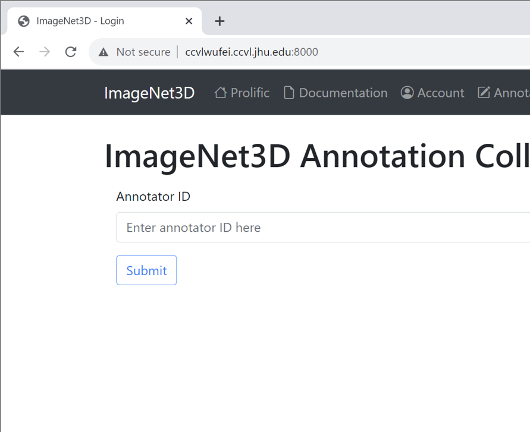
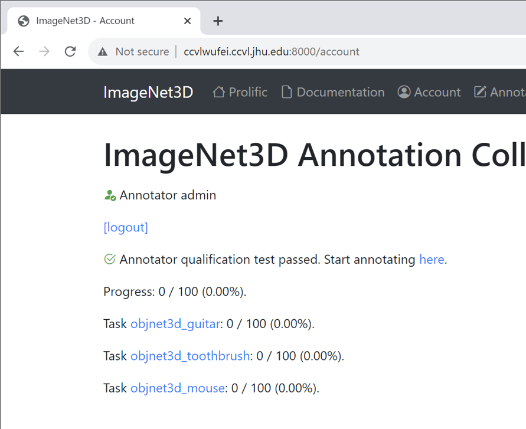
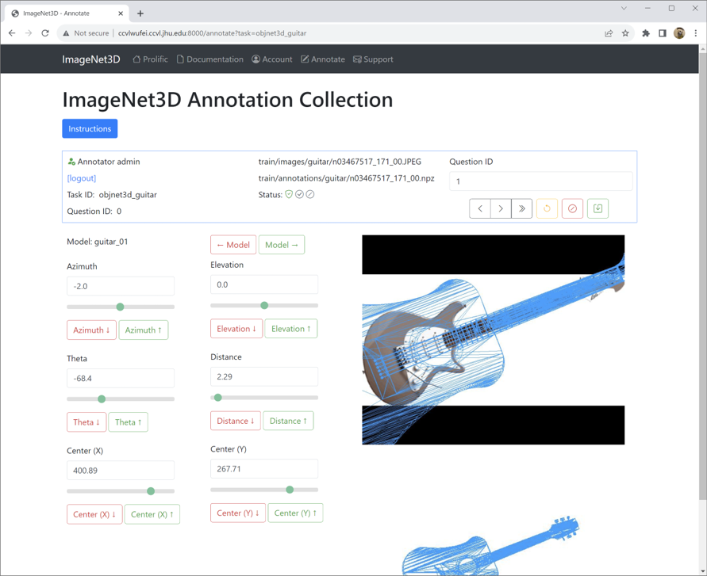

ImageNet3D
**********

.. warning::

   **DO NOT DISTRIBUTE.** This wiki page is for internal use only. It is forbidden to copy, forward, or in any way reveal the contents of this wiki to anyone.

Annotation Guidelines
---------------------

Annotations Collected for Each Object
=====================================

* **3D rotation of the object**: azimuth, elevation, and in-plane rotation
* **2D location**: 2D location of the center of the object in the image plane
* **Distance**: distance from the camera to the object, specifying the size of the object in the image
* **Object quality**: quality of the object:
    - Good: most parts of the object is visible in the image
    - Partially visible: a small part of the object is occluded by other objects or outside the image
    - Barely visible: only a small part of the object is visible; the other parts are occluded or outside the image
    - Bad quality / no object: most parts of the object is occluded or outside the image; we can see there is an object but very hard to tell the pose of the object
* **Dense scene**: if the object is very close to another object from the same category; here "close" is defined in the 2D image plane -- two objects are close if the distance between them is small in the 2D image plane
    - Not dense scene: the object is not close to another object from the same category; there can be multiple objects from the same category in one image but the objects are far away from each other
    - Dense scene: the object is very close to another object from the same category; they may occlude each other or just very close -- imagine a parking lot where cars are close to each other.

Note that when an object is **barely visible** or of **bad quality / no object**, use you imagination and annotate your best guess of the pose. It is fine if the pose is not accurate.

Demo
----

First connect to Johns Hopkins VPN, then access the link `here <http://ccvlwufei.ccvl.jhu.edu:8000/>`_. You will log in with your assigned unique annotator ID.

Annotation Tool
---------------

Each annotator will be assigned to a unique ID. You will use this ID to log in to the annotation system.

    Login page

After logged in, you will be redirect to the account page where you will see the lists of tasks you are assigned to and the current annotation progress.

    Account page

You may start annotating the data by clicking on any of the task name, which will direct you to the annotation page. For buttons and icons without texts, hovering on them would reveal text explanations.

    Annotation page

Timeline
--------

**Stage I (with JH undergrads).**

* Oct 01: Releasing annotation tasks to the annotators.

Resources
---------

* `Tutorial slides (Sep 18, 2023) <https://drive.google.com/file/d/1XNQxMHM4MS7TlewMeYRNO60t8oM8YYbO/view?usp=sharing>`_

Support
-------

* Discord group support channel. Send email for access.
* By email: `Wufei Ma <mailto:wufeim@gmail.com?subject=[ImageNet3D Support] title>`_.
