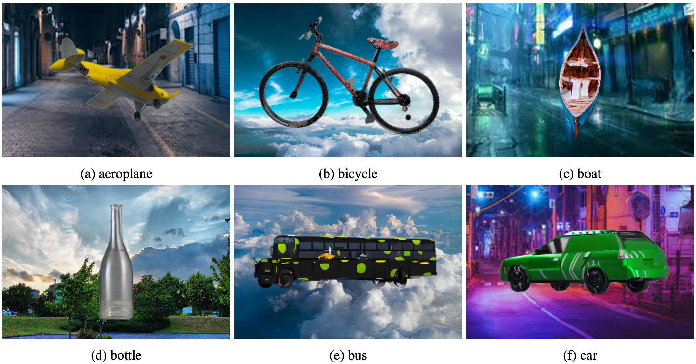

SyntheticPascal3D Dataset
*************************

.. warning::

   **DO NOT DISTRIBUTE.** This wiki page is for internal use only. It is forbidden to copy, forward, or in any way reveal the contents of this wiki to anyone.

SyntheticPascal3d (also known as SyntheticP3D or P3D-Diffusion) was first proposed in `Robust category-level 3D pose estimation from synthetic data <https://arxiv.org/abs/2305.16124>`_ by Jiahao Yang et al. Specifcially, we render CAD models from PASCAL3D+ with augmented textures obtained from `DTD <https://www.robots.ox.ac.uk/~vgg/data/dtd/>`_. Then images are fed into a graphics-guided diffusion model (i.e., `ControlNet <https://github.com/lllyasviel/ControlNet>`_) for better realism. Finally, we overlay the generated objects on some (less than 100) collected background images based on rendered object masks.

This dataset is currently deprecated. We recommend `DST-Pose <https://wufei-wiki.readthedocs.io/en/latest/dst.html>`_ for a richer set of CAD models and better overall quality.

    Example images from SyntheticPascal3D dataset.
